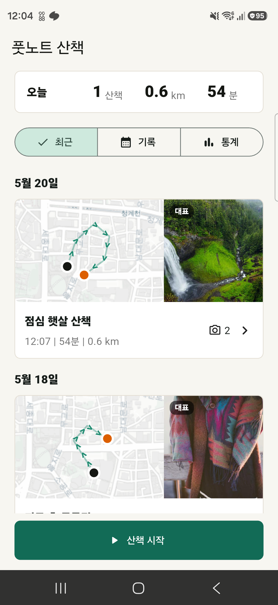
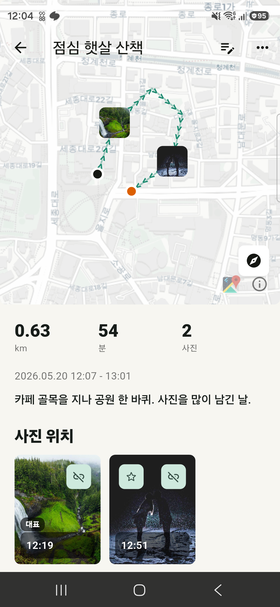

# Footnote Walk

산책의 경로, 사진, 메모를 한 번에 남기는 Android-first Flutter 앱입니다. GPS로 이동 경로를 기록하고, 산책 중 찍은 사진을 지도 위 위치와 함께 정리합니다.

<p align="center">
  
  
</p>

## 주요 기능

- 2초 간격 GPS 기록으로 산책 경로 저장
- 기록 중 화면을 벗어나도 Android foreground service로 위치 추적 유지
- 산책별 거리, 시간, 사진 수 요약
- 최근 기록, 월별 기록, 통계 화면 제공
- 지도 위 이동 방향 표시
- 상세 지도에서 경로에 맞춘 자동 확대/축소, 과도한 확대 제한
- 사진 위치 마커와 사진 썸네일 표시
- 대표사진 설정: 사용자가 지정한 사진 우선, 없으면 첫 번째 사진
- 제목과 메모 편집
- GPX 파일 공유
- 현재 지도 화면 이미지 공유

## 화면 구성

### 홈

홈에서는 오늘의 산책 요약과 최근 산책 기록을 바로 확인할 수 있습니다. 각 기록 카드는 이동 경로 지도와 대표사진을 함께 보여줍니다.

- 사진이 있는 기록: `지도 + 대표사진`
- 사진이 없는 기록: 지도 전체 표시
- 카드나 지도 영역을 누르면 상세 화면으로 이동

### 상세

상세 화면은 이동 경로를 중심으로 구성되어 있습니다. 지도는 경로 전체가 보이도록 자동 조정되며, 같은 위치 근처에서 짧게 움직인 기록은 너무 확대되지 않도록 최대 줌을 제한합니다.

사진은 산책 시간대와 위치를 기준으로 연결할 수 있고, 대표사진을 직접 지정할 수 있습니다.

## 기술 스택

- Flutter / Dart
- Android
- `flutter_map` with CARTO Positron tiles based on OpenStreetMap data
- `geolocator` for GPS tracking
- `image_picker` for camera capture
- `photo_manager` for gallery photo lookup
- `media_store_plus` for saving app-captured photos
- `sqflite` for local persistence
- `share_plus` for GPX and image sharing

## 프로젝트 구조

```text
lib/
  models/
    walk_models.dart
  screens/
    home_screen.dart
    record_walk_screen.dart
    walk_detail_screen.dart
  services/
    active_walk_service.dart
    gpx_exporter.dart
    location_tracker.dart
    photo_storage.dart
    session_photo_finder.dart
    share_card_exporter.dart
    walk_repository.dart
  widgets/
    session_photo_manager_sheet.dart
    walk_map_preview.dart
    walk_photo_image.dart
```

## 데이터

앱은 로컬 SQLite 데이터베이스를 사용합니다.

```text
walk_sessions
track_points
walk_photos
```

사진 원본은 SQLite에 저장하지 않습니다. DB에는 사진 경로와 메타데이터만 저장하고, 원본 파일은 Android 갤러리 또는 사용자가 선택한 위치에 남습니다.

## Android 권한

주요 권한은 `android/app/src/main/AndroidManifest.xml`에 포함되어 있습니다.

```xml
ACCESS_FINE_LOCATION
ACCESS_COARSE_LOCATION
CAMERA
INTERNET
READ_MEDIA_IMAGES
READ_MEDIA_VISUAL_USER_SELECTED
READ_EXTERNAL_STORAGE
WRITE_EXTERNAL_STORAGE
FOREGROUND_SERVICE
FOREGROUND_SERVICE_LOCATION
WAKE_LOCK
```

## 실행

```powershell
$env:Path="C:\Users\dukim\tools\flutter\bin;$env:Path"
flutter pub get
flutter analyze
flutter test
flutter run -d <device-id>
```

개발 중 기기 배포:

```powershell
.\scripts\deploy-release.ps1
```

이 스크립트는 `adb install -r`로 APK만 덮어 설치합니다. 앱 데이터와 로컬 SQLite DB를 유지하려면 개발 중에는 `flutter install --release` 대신 이 스크립트를 사용하세요.

## 참고

- 지도 타일은 현재 CARTO/OSM 기반 타일을 사용합니다. 공개 배포 시에는 사용량 정책에 맞는 프로덕션 타일 제공자 검토가 필요합니다.
- 위치 정확도는 기기 GPS, 절전 정책, 주변 환경의 영향을 받습니다.
